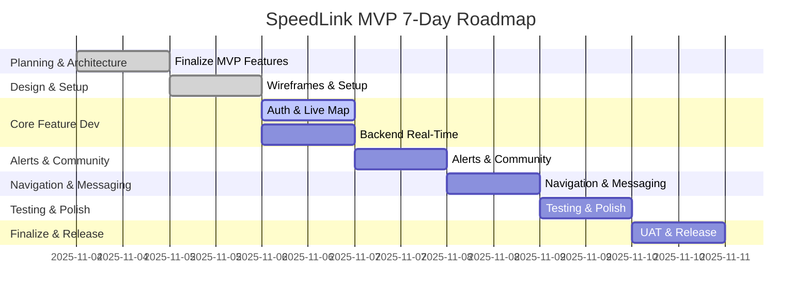

# SpeedLink MVP Roadmap (7 Days)

## Overview
This document outlines the 7-day MVP delivery plan for SpeedLink, a mobile-first PWA for real-time group navigation and safety alerts.

## Roadmap Table
| Day | Focus | Key Tasks |
|-----|-------|----------|
| 1 | Planning & Architecture | Finalize MVP features, define stack, design architecture |
| 2 | Design & Setup | Wireframes, repo setup, scaffold PWA/backend, mapping SDK |
| 3 | Core Feature Dev | Auth, party/group creation, live map, backend real-time |
| 4 | Alerts & Community | Alerts system, community reporting, push notifications |
| 5 | Navigation & Messaging | Route navigation, in-app messaging, privacy controls |
| 6 | Testing & Polish | Internal testing, bug fixes, performance, legal/privacy |
| 7 | Finalize & Release | UAT, docs, deploy MVP, collect feedback |

## Mermaid Gantt Chart

## Notes
- Focus on core features only for MVP.
- Use AI tools to accelerate all phases.
- Daily check-ins to adjust and unblock.